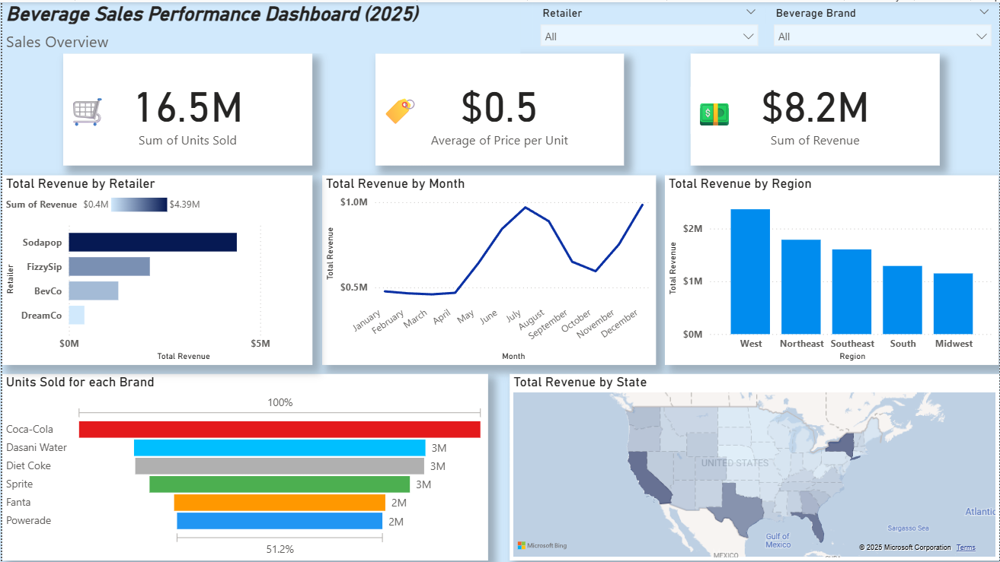

# 🛒 Beverage_Sales_Dashboard

This project is a Power BI dashboard that analyzes sales performance of an e-commerce store.

## 📊 Key Insights
- Revenue by region and product category
- Top-selling products
- Monthly sales trend
- Customer segmentation

## 📂 Project Files
- `Beverage-Sales-Storytelling.pptx` → Full dashboard exported from Power BI
- `Company (1).xlsx` → Sample dataset used

## 🚀 Tools Used
- Power BI Desktop
- Excel data
- GitHub for documentation

## 📷 Dashboard Preview

